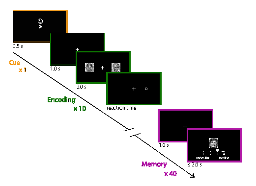

# Overview

This repository contains the experiment and analysis code for a psychology experiment exploring the relationship between covert attention and recognition memory.  

# Installation

Add instructions

# Running the task

Add instructions

# Analyzing data

Provide sample data, code, and instructions

# Acknowledgements

This code is adapted from the Posner code provided by Github user CypressA.
