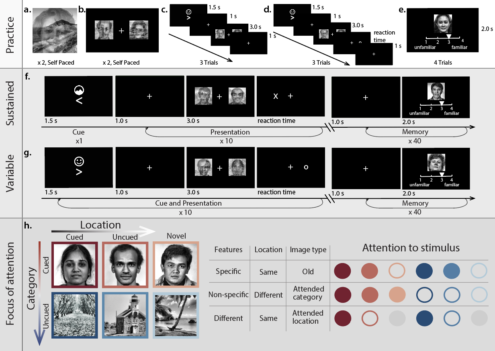
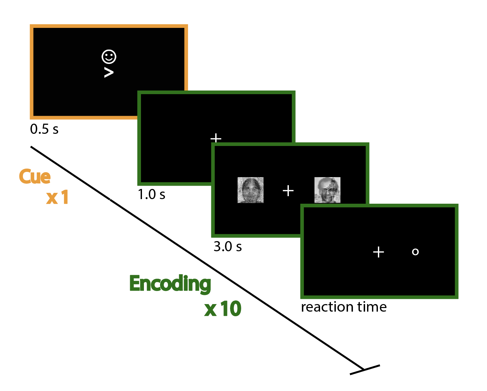

# Overview

This repository contains the [Psychopy](http://psychopy.org/) code for a psychology experiment exploring the relationship between covert attention and recognition memory.

# Paradigm

There are two versions of this experiment: a block design version (Sustained Attention Experiment), and a trial-wise cuing version (Variable Attention Experiment). Both begin with an initial practice task to orient the participant to the task instructions, then a Presentation block.

In <b>Presentation blocks</b>, the subject views ten pairs of composite image stimuli (overlayed images of faces and scenes) like the one shown below, presented on the right and left of the screen. The subject is cued to attend one part of the composites presented on a particular side, while keeping their eyes fixated at center (that is, they should employ covert attention). After each image pair, a letter ('x' or 'o') appears on screen and the subject presses a button (1 or 3, respectively) to indicate which letter they see. 

In <b>Memory blocks</b>, the subject views 40 single, non-composite images, and rates each image as being "familiar" or "unfamiliar" on a scale of 1-4. The images shown are 50% novel images and 50% images previously seen in the most recent Presentation block (with an equal proportion of previously seen images pulled from each presentation side - R/L - and each image category - face/place).

 
 # Full Paradigm Schematic
 

 

# Directory Organization

<!--The code directory contains scripts for running the main task, generating stmiuli (image processing and overlaying), and conducting cursory behavioral analyses (in the form of easily accesible .ipynb files, for use with [jupyter notebook](https://ipython.org/notebook.html)).-->

<!--The stim directory contains all necessary image stimuli, separated by image type (overlay, sinlge face, single place, practice images, etc.)-->

<!--The test directory contains code to run a basic data check to ensure all stimuli were displayed correctly, after data collection. To use the checker, run data_check.ipynb in jupyter notebook.-->

# Running the task

To run a behavioral participant, simply open attention_memory.py in Psychopy, hit the green "run" button in the code viewer, and enter the subejct ID and run#!  

The subject name or number can be arbitrarily chosen by the experimenter (any number or string).

The run number indicates on which run to start the experiment. If the subject is just beginning the experiment, the run # should be 0. A run number of 0 will initiate the experiment on the first run, and loop over presentation and memory runs until the total number of desired runs (outlined in the parameters in attention_memory.py) has been presented. 

If the experiment is started at run 5, the experiment will loop over runs 5:number-of-total-runs (the default setting is to have eight runs, 0-7, so starting on run 5 would loop over runs 5, 6, and 7).

If the subject self-reports moving their head from the chin rest during the experiment, the experiment window will close to allow for eye tracking recalibration, at which point the experimenter should recalibrate as needed, then restart the experiment entering the next run # (for example, if the subject reported taking a bathroom break after run 3, experimenter should recalibrate then initiate the experiment again entering the same IDENTICAL subject name and the NEXT desired run#: 4)

# Acknowledgements
Thanks to Megan deBettencourt for providing the image processing script available in this repository (code/stim/process_images.m) and recommending stimulus sets. 

FACE STIMULI:
J. Xiao, J. Hays, K. Ehinger, A. Oliva, and A. Torralba.
SUN Database: Large-scale Scene Recognition from Abbey to Zoo.
IEEE Conference on Computer Vision and Pattern Recognition (CVPR)

SCENE STIMULI:
P. Jonathon Phillips, Harry Wechsler, Jeffrey Huang, Patrick J. Rauss: The FERET database and evaluation procedure for face-recognition algorithms. Image Vision Comput. 16(5): 295-306 (1998)

